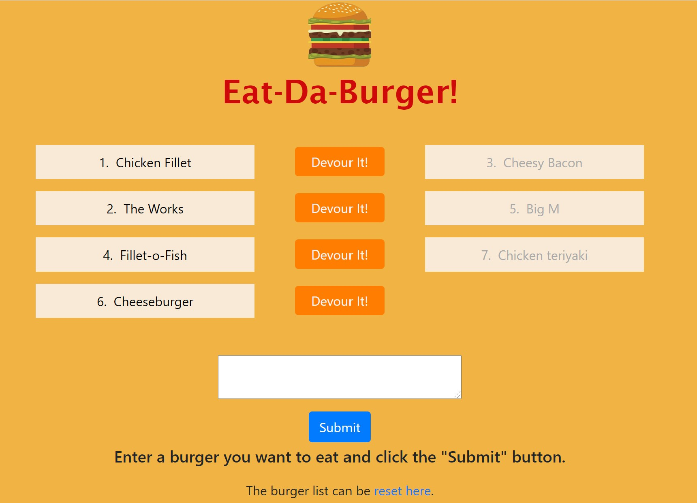

<!-- @format -->

# burger

A burger logger using MySQL, Node, Express, Handlebars and an ORM.

## User Story

Given a demonstration of a web page, this project required the development of the complete front and back end. MySQL is used to store information, Express and Nodejs are used server side, with Handlebars used to dynamically create page content.

The user requirement is to enter the name of a burger the user would like to eat, with the entered burger appearing on the left hand side of the screen along with a corresponding button allowing the user to devour the burger. Once the burger is eaten, it moves to the devoured list on the right hand side of the screen.

Additional functionality was added to reset all burgers to not eaten, primarily for testing purposes.

#### ToDos

<ol><li>Allow editing and deletion of individual burgers.</li>
<li>Deletion of all burgers in one action.</li>
</ol>

## Built With

- [VScode](https://code.visualstudio.com/) - The editor of choice

#### Initial interface

### Licence

GNU General Public License v3.0

### Link to the github Repo

<a href="https://github.com/galluk/burger">Eat-da-Burger</a>

## Author

- **Luke Gallagher** -
  luke.gallagher.cst@gmail.com
